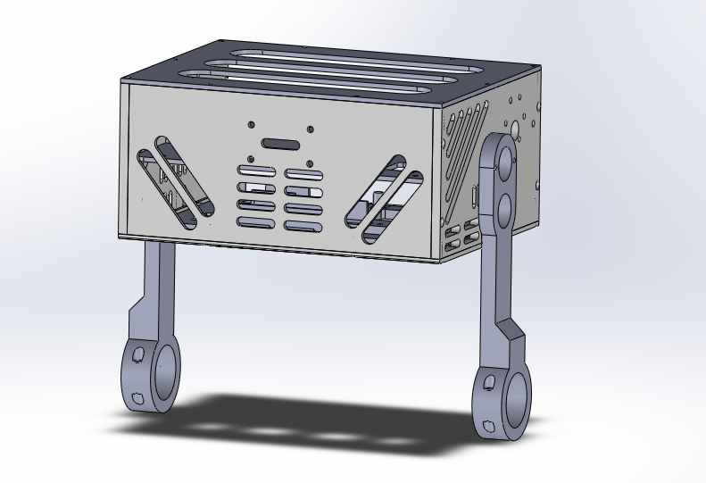

<div align="center">
  
  <h1>BipedalV1 Firmware</h1>
  <p>Self-balancing two-wheeled robot controller based on the STM32F411CEU6.</p>
</div>

<br>

This repository contains the firmware for BipedalV1, an autonomous self-balancing platform. The system implements a rigid closed-loop PID control architecture, fusing data from a six-axis Inertial Measurement Unit (IMU) to command independent wheel actuators. It is designed for operational stability, utilizing non-blocking hardware interrupts, Direct Memory Access (DMA), and locked anti-phase motor control to ensure deterministic response times.

## System Specifications

- **Microcontroller:** STM32F411CEU6 (Cortex-M4F)
- **Memory:** 128 KB SRAM, 512 KB Flash
- **Sensors:** MPU6050 (IMU), AS5600 (Magnetic Encoder)
- **Actuation:** Dual independent DC motors via Timer-driven PWM

## Core Architecture & Working Principles

The firmware operates on a bare-metal architecture, leveraging hardware-level features of the STM32 for precise control:

- **Inertial Measurement:** Pitch and roll angles, alongside angular velocities, are sampled from the MPU6050 over an I2C bus. To maintain deterministic execution in the main loop, a hardware data-ready interrupt (EXTI) triggers DMA transactions for sensor acquisition, eliminating polling overhead.
- **Balancing Control:** A proportional-integral-derivative (PID) controller processes the IMU data to compute the required corrective motor effort. For safety, the control loop includes an automatic cutoff; power to the actuators is isolated if the chassis roll angle exceeds 30 degrees.
- **Actuator Control (Locked Anti-Phase):** The wheel motors are driven using locked anti-phase PWM generated by Timer 2. In this configuration, a 50% duty cycle holds the motor stationary, duty cycles above 50% drive the motor forward, and below 50% reverse it. This allows seamless zero-crossing speed transitions without requiring secondary direction pins.
- **Power Management:** An ADC channel continuously samples the battery voltage across a 108.52 kΩ / 33.0 kΩ voltage divider network. The logic maps the ADC readings to estimate the remaining capacity of a standard 3S LiPo pack (11.0V – 12.6V).
- **User Interface & Diagnostics:** A single tactile switch handles state inputs. A sustained one-second press initiates the MPU6050 accelerometer calibration sequence, signaled by the onboard LED. A dedicated PWM channel drives a piezo buzzer for auditory alerts.

## File Structure

```text
BipedalV1/
├── CMakeLists.txt              # CMake build configuration for ARM cross-compilation
├── linker.ld                   # GNU linker script for memory region allocation
├── readme.md                   # Project documentation
├── include/
│   ├── ActuatorManager.h       # PWM control logic for the left and right wheels
│   ├── BalancePID.h            # PID controller implementation for stabilization
│   ├── BatteryManager.h        # ADC-based battery voltage monitoring
│   ├── Buzzer.h                # PWM control logic for the buzzer
│   ├── LPC/                    # Header files for LPC components
│   └── drivers/                # Hardware abstraction layer (GPIO, I2C, MPU6050, PWM, etc.)
├── src/
│   ├── BalancePID.cpp          # PID control logic implementation
│   └── main.cpp                # Main execution loop, hardware initialization, and event handling
├── scripts/                    # Utility scripts for development and deployment
├── CAD/                        # Mechanical design files
└── startup.cpp                 # System reset handler and interrupt vector table
```

## Hardware Pin Mapping

The following hardware connections are configured in the software abstraction layer:

- **PA0**: User Button (Input, Pull-Up, Active Low)
- **PA1**: Left Wheel Motor PWM (Timer 2, Channel 2)
- **PA2**: Right Wheel Motor PWM (Timer 2, Channel 3)
- **PA4**: Phased Anti-lock PWM Enable (Output)
- **PB0**: Battery Voltage Monitoring (ADC1)
- **PB5**: MPU6050 Data Ready Interrupt (EXTI Line 5, Rising Edge)
- **PB6**: Buzzer PWM (Timer 4, Channel 1)
- **PB7**: MPU6050 SDA (I2C1)
- **PB8**: MPU6050 SCL (I2C1)
- **PB9**: Multiplexer SDA (I2C2)
- **PB10**: Multiplexer SCL (I2C2)
- **PC13**: Onboard LED (Output, Active Low)

## Build & Flash Instructions

The firmware is configured via CMake and can be flashed using the onboard USB peripheral in DFU mode, or via a standard ST-Link debug probe.

### Method 1: Onboard USB (DFU)

```bash
dfu-util -a 0 -d 0483:df11 -s 0x08000000:leave -D cmake-build-debug/BipedalV1.bin
```

### Method 2: ST-Link Programmer

```bash
cmake --build cmake-build-debug/ --target BipedalV1 && st-flash write cmake-build-debug/BipedalV1.bin 0x08000000
```

## Reference Documentation

- [GNU Linker Script Example](https://sourceware.org/binutils/docs/ld/Simple-Example.html)
- `ReferenceManual.pdf` — STM32F411 Reference Manual
- `programming manual.pdf` — STM32F411 Programming Manual
- `DataSheet.pdf` — STM32F411 Datasheet
- `Alternate Function Table.pdf` — GPIO Alternate Function Mappings